<!-- Generated locally and committed to this repository. No hosted stats service required. -->

<h3><code>steven@github ~ $ ./contributions.sh</code></h3>

 
 

<h3><code>steven@github ~ $ whoami</code></h3>

<table>
<tr>
<td valign="top"></td>
<td valign="top"></td>
</tr>
</table>

 
 

<h3><code>steven@github ~ $ ./connect.sh</code></h3>

<b>Freelance Developer · Web &amp; Mobile Builder · Lifelong Learner</b>

 

The contribution graph refreshes automatically every day. The portrait and profile card are self-contained animated SVGs.

